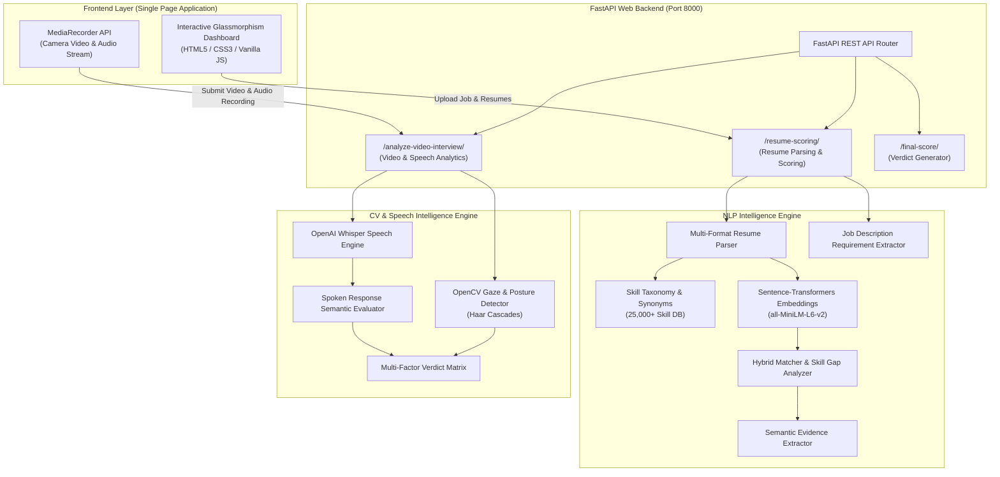
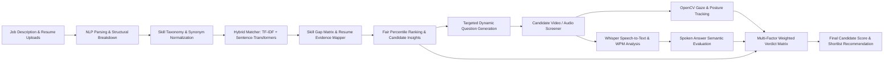
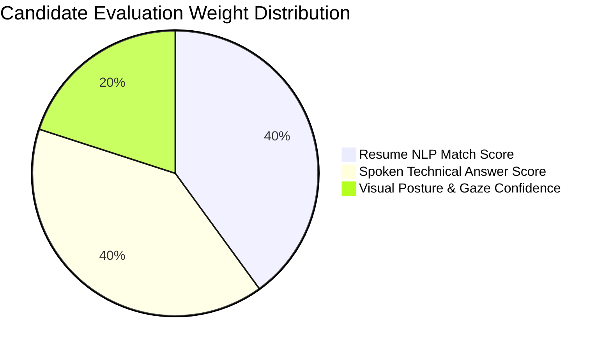

# 🎯 Talent-Lens: AI Hiring & Talent Intelligence System

[](https://www.python.org/)
[](https://fastapi.tiangolo.com/)
[](https://www.sbert.net/)
[](https://opencv.org/)
[](https://github.com/openai/whisper)
[](https://opensource.org/licenses/MIT)

> **Enterprise-grade, AI-driven Candidate Intelligence Platform** combining deep semantic resume matching, automated skill gap taxonomy, real-time Computer Vision gaze/posture tracking, OpenAI Whisper audio speech evaluation, and multi-factor candidate ranking into a unified hiring verdict.

---

## 🌟 Executive Overview

**Talent-Lens** is an end-to-end recruitment intelligence platform designed to eliminate bias, streamline candidate shortlisting, and conduct automated technical video screeners. By synthesizing Machine Learning (NLP), Computer Vision (CV), and Automatic Speech Recognition (ASR), the system delivers a 360° multi-factor candidate evaluation in seconds.

> [!IMPORTANT]
> Unlike basic ATS tools that rely on simple keyword counting, **Talent-Lens** uses contextual transformer embeddings (`all-MiniLM-L6-v2`) to capture deep semantic intent, cross-references skills against a **25,000+ skill taxonomy**, and aggregates visual/auditory signals during video interviews.

---

## 🔥 Key Capabilities

### 1. 📄 Multi-Candidate Resume Intelligence
- **Deep Semantic Matching**: Combines TF-IDF keyword density with vector cosine similarity embeddings to evaluate candidate fit beyond exact word matches.
- **Evidence Extraction**: Maps candidate claimed skills directly to verifiable resume snippet evidence with line context.
- **Fair Percentile Ranking**: Automatically normalizes scores across candidate pools to present relative percentile ranks and clear hiring recommendations.
- **Multi-Format Parsing**: Native extraction support for `.pdf`, `.docx`, and `.txt` resume formats using `pdfplumber` and `python-docx`.

### 2. 🧠 Automated Skill Gap & Synonym Engine
- **Taxonomy Normalization**: Resolves variant skill names automatically (e.g., `React.js` ↔ `React`, `PyTorch` ↔ `Torch`, `PostgreSQL` ↔ `Postgres`, `Kubernetes` ↔ `K8s`).
- **Comprehensive Skill Database**: Pre-loaded with over 25,000 domain skills categorized across Software Engineering, Data & AI, Finance, Digital Marketing, and Sales.
- **Gap Matrix**: Categorizes candidate skills into *Matched Required*, *Matched Optional*, *Missing Essential*, and *Partial Competencies*.

### 3. 🎯 Dynamic Technical Interview Generation
- **Skill-Targeted Questioning**: Generates tailored technical questions based on the candidate's top extracted skills and target job domain.
- **Context-Aware Prompts**: Formulates scenario-based engineering challenges to test real-world candidate expertise.

### 4. 👁️ Computer Vision Gaze & Posture Analytics
- **Visual Confidence Scoring**: Uses OpenCV and Haar Cascades for real-time face detection, eye gaze alignment tracking, and head stability scoring.
- **Engagement Metrics**: Quantifies camera focus, posture stability, and eye contact consistency during candidate video screeners.

### 5. 🎙️ Audio Speech-to-Text & Answer Evaluation
- **OpenAI Whisper ASR**: Transcribes candidate spoken answers with high accuracy.
- **Speech Dynamics Analysis**: Calculates Words Per Minute (WPM), speech pace ratings (*Optimal*, *Fast*, *Slow*), and filler word counts.
- **Semantic Answer Matching**: Measures how accurately candidate spoken responses address the generated technical interview prompt using semantic similarity metrics.

### 6. 📊 Multi-Factor Hiring Verdict Matrix
- Aggregates multi-modal data streams into a weighted final decision:
  $$\text{Verdict Score} = 0.40 \times \text{Resume NLP Score} + 0.40 \times \text{Spoken Answer Score} + 0.20 \times \text{Visual Confidence Score}$$
- Instant verdict classifications: **Strong Hire** 🟢, **Qualified Hire** 🟡, **Needs Review** 🟠, or **Unfavorable Match** 🔴.

---

## 📐 System Architecture & Workflow

### High-Level System Architecture


---

### Candidate Processing & Evaluation Pipeline


---

### Multi-Factor Evaluation Weighting Matrix


---

## 🛠️ Technology Stack

| Domain | Technologies & Libraries |
| :--- | :--- |
| **Backend Framework** | [FastAPI](https://fastapi.tiangolo.com/), Uvicorn, Async Python 3.10+ |
| **Machine Learning & NLP** | [Sentence-Transformers (`all-MiniLM-L6-v2`)](https://www.sbert.net/), [SpaCy](https://spacy.io/), SciKit-Learn, NumPy |
| **Computer Vision** | [OpenCV (`opencv-python`)](https://opencv.org/), Haar Cascade Classifiers |
| **Speech Recognition** | [OpenAI Whisper](https://github.com/openai/whisper) |
| **Document Processing** | `pdfplumber`, `python-docx` |
| **Frontend** | Modern Vanilla JavaScript, CSS3 Custom Design System (Glassmorphism), HTML5 Web Audio & MediaRecorder APIs |
| **Deployment** | Docker, Docker Compose, Uvicorn ASGI |

---

## 📂 Project Structure

```
d:\AI-hiring-intelligence-system
├── Backend/
│   └── main.py                     # FastAPI server, REST endpoints, CORS & file upload handling
├── CV_Engine/
│   ├── audio_transcriber.py        # OpenAI Whisper ASR & speaking pace (WPM) calculator
│   ├── interview_evaluator.py      # Dynamic question generator, semantic answer evaluator & verdict engine
│   ├── main.py                     # Real-time camera gaze tracking & visual posture scoring
│   └── detection/                  # Haar Cascade XML models for face & eye tracking
├── NLP_Engine/
│   ├── job_parser.py               # Job description parser & requirement skill extractor
│   ├── matcher.py                  # Hybrid matcher combining TF-IDF & Sentence-Transformers
│   ├── skill_db.py                 # 25,000+ domain technical skill database
│   ├── skill_synonyms.py           # Synonym dictionary & normalization rules
│   ├── skill_gap_analyzer.py       # Candidate skill coverage vs missing job requirements
│   ├── evidence_mapper.py          # Extractor of resume snippet evidence for skills
│   ├── explanation_engine.py       # Natural language candidate insights & gap analysis
│   └── parsers/
│       └── resume_parser.py        # PDF, DOCX, and TXT resume file reader & section parser
├── index.html                      # Interactive web application dashboard
├── main.py                         # CLI script for processing candidate resumes
├── requirements.txt                # Dependency manifest
└── Dockerfile                      # Production container deployment script
```

---

## ⚡ Quick Start & Setup Guide

### Prerequisites
- **Python 3.10 or higher**
- **FFmpeg** installed and accessible in System PATH (required for Whisper audio processing)
- **Web Browser** (Chrome, Edge, Firefox) with camera & microphone permissions

### 1. Clone the Repository
```bash
git clone https://github.com/your-username/AI-hiring-intelligence-system.git
cd AI-hiring-intelligence-system
```

### 2. Create and Activate a Virtual Environment
```bash
# Windows
python -m venv venv
venv\Scripts\activate

# Linux / macOS
python3 -m venv venv
source venv/bin/activate
```

### 3. Install Dependencies
```bash
pip install -r requirements.txt
```

> [!TIP]
> The first run will automatically download the lightweight `all-MiniLM-L6-v2` transformer model (~80MB) and OpenAI Whisper model (~140MB) into the local cache.

### 4. Launch the Backend & Dashboard
```bash
uvicorn Backend.main:app --reload --port 8000
```
Open your browser and navigate to:
**`http://localhost:8000`**

---

## 🐳 Docker Deployment

Run the entire application in a containerized environment:

```bash
# Build the Docker image
docker build -t talent-lens-ai .

# Run the container on port 8000
docker run -p 8000:8000 talent-lens-ai
```

---

## 🔌 API Reference

### `POST /resume-scoring/`
Processes job description text and multi-file resume uploads (`.pdf`, `.docx`, `.txt`).

**Form Data Parameters:**
- `job_text` *(string)*: Plain text of the job posting requirements.
- `files` *(UploadFile)*: One or multiple resume files.

**Sample JSON Response:**
```json
{
  "total_candidates": 2,
  "ranked_candidates": [
    {
      "rank": 1,
      "percentile": 100.0,
      "filename": "john_doe_resume.pdf",
      "final_score": 88.5,
      "matched_required": ["Python", "FastAPI", "Docker", "PyTorch"],
      "missing_required": ["Kubernetes"],
      "total_experience": 5,
      "candidate_insights": {
        "summary": "Strong candidate matching 88.5% of core requirements with 5 years experience.",
        "key_strengths": ["Demonstrates strong hands-on Python and FastAPI experience."]
      }
    }
  ],
  "question": "As a Software & Systems Engineering professional using your key competencies in Python, FastAPI, Docker, walk us through a major backend architecture problem you solved."
}
```

---

### `POST /analyze-video-interview/`
Analyzes candidate video interview audio recording and calculates multi-factor hiring decision.

**Form Data Parameters:**
- `audio` *(UploadFile)*: Audio recording (`.webm`, `.mp3`, `.wav`).
- `duration` *(int)*: Interview duration in seconds.
- `resume_score` *(float)*: Candidate resume NLP score.
- `question_text` *(string)*: Target interview question.

**Sample JSON Response:**
```json
{
  "cv_analysis": {
    "confidence_score": 85.0,
    "eye_contact_ratio": 0.88,
    "gaze_centered_percentage": 91.2
  },
  "speech_transcription": {
    "transcript": "In my previous role, I designed high-throughput FastAPI microservices...",
    "wpm": 138.5,
    "pace_rating": "Optimal"
  },
  "spoken_evaluation": {
    "spoken_answer_score": 82.0,
    "semantic_relevance": "High"
  },
  "multifactor_verdict": {
    "final_verdict_score": 84.0,
    "verdict_label": "Strong Hire",
    "recommendation": "Candidate demonstrates high technical competency, coherent spoken communication, and strong visual engagement."
  }
}
```

---

## 🎯 Key Design Principles

1. **Explainable AI (XAI)**: Every candidate score comes with explicit reasoning, resume evidence snippets, and skill gap breakdowns—no black-box scoring.
2. **Bias Mitigation**: Relative ranking and skill-weighted evaluation ensure all candidates are assessed strictly on demonstrated technical competency.
3. **High Performance**: Asynchronous FastAPI handlers and cached model singletons ensure sub-second candidate scoring even with large resume batches.

---

## 📜 License

Distributed under the MIT License. See `LICENSE` for more information.

---

<p align="center">
  <b>Built with ❤️ for Modern Tech Recruitment Teams & AI Engineers</b>
</p>